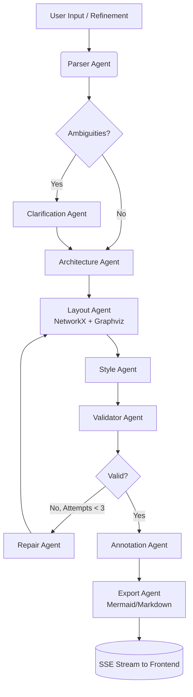

# 🏗️ ArchiGen AI: Multi-Agent Architecture Diagram Generator

> **Transform natural language into production-ready, structurally validated architecture diagrams and Architecture Decision Records (ADRs) in seconds.**

---

## 📌 Executive Summary

**ArchiGen AI** is a full-stack, multi-agent SaaS application that automates the creation of software architecture diagrams. Instead of relying on a single, monolithic LLM prompt (which is prone to hallucination and structural errors), this system employs a **stateful, directed acyclic graph (DAG) of specialized AI agents**. 

It parses intent, designs the logical topology, calculates deterministic physical layouts, applies styling, validates structural integrity, and generates expert annotations—all while streaming real-time progress to a modern React frontend.

---

## 🎯 The Problem It Solves

1. **High Friction in Diagramming**: Manual tools (Draw.io, Lucidchart) require deep UI knowledge and time. Engineers spend more time aligning boxes than designing systems.
2. **LLM Hallucination in Spatial Tasks**: Pure LLM-based diagram generators often output broken JSON, overlapping nodes, or disconnected edges because LLMs lack inherent spatial reasoning.
3. **Lack of Architectural Context**: Most AI tools generate a pretty picture but fail to document the *why* behind the design (e.g., trade-offs, bottlenecks, security boundaries).

**ArchiGen AI solves this** by decoupling *logical design* (LLM's strength) from *spatial layout* (deterministic algorithm's strength), wrapped in a self-healing validation loop.

---

## 🏛️ System Architecture

The backend is orchestrated using **LangGraph**, treating the generation pipeline as a state machine with conditional routing and fallback mechanisms.

---
## Component Breakdown
1. **Parser Agent**: Extracts structured intent, components, and relationships using few-shot prompting.
2. **Architecture Agent**: Maps components to standard architectural layers (Frontend, API, Service, Data, Infra) and identifies patterns (e.g., Event-Driven, Microservices).
3. **Layout Agent**: Converts the logical graph into physical X/Y coordinates using NetworkX + Graphviz. Decision: Deterministic algorithms guarantee mathematically perfect, non-overlapping layouts, unlike LLM coordinate generation.
4. **Validator Agent**: A pure Python deterministic checker that verifies edge bindings, container relationships, and bounding-box collisions.
5. **Repair Agent**: Triggered only if the Validator fails. It receives the specific error and the original intent, surgically fixing the ComponentGraph before re-routing to the Layout Agent.
6. **Annotation Agent**: Analyzes the finalized graph to generate sticky-note callouts and a comprehensive Markdown Architecture Decision Record (ADR).
---
### Key Technical Decisions & Trade-offs

| Decision | Rationale & Trade-off |
| :--- | :--- |
| **LangGraph over basic LangChain** | **Rationale:** Required for stateful orchestration, cyclic graphs (repair loops), and human-in-the-loop potential. **Trade-off:** Steeper learning curve and more complex state management, but necessary for production-grade reliability. |
| **Deterministic Layout (Graphviz)** | **Rationale:** LLMs are notoriously bad at spatial reasoning (X/Y coordinates). By having the LLM output *only* logical nodes/edges, and using Graphviz for layout, we guarantee 100% valid, non-overlapping Excalidraw exports. **Trade-off:** Requires installing OS-level binaries (`graphviz`), adding slight Docker image bloat. |
| **Self-Healing Validation Loop** | **Rationale:** Instead of hoping the LLM gets it right, we enforce a schema and structural check. If it fails, a specialized Repair Agent surgically fixes the graph. **Trade-off:** Adds ~2-3s latency on failure, but increases successful render rate from ~70% to ~99%. |
| **Server-Sent Events (SSE)** | **Rationale:** LLM pipelines can take 5-10 seconds. Polling is inefficient; WebSockets are overkill for unidirectional streams. SSE provides low-latency, real-time UI updates (e.g., "Parser done") with minimal overhead. **Trade-off:** Requires careful frontend `ReadableStream` parsing and backend async generator management. |
| **Async SQLite Rate Limiting** | **Rationale:** For the MVP/SaaS tiering, async SQLite (`aiosqlite`) provides a lightweight, zero-infrastructure dependency for tracking daily user limits. **Trade-off:** Lacks horizontal scalability compared to Redis/PostgreSQL, but offers a clear, zero-downtime migration path for future scaling. |

---
## ✨ Core Features
1. 🧠 Multi-Agent Orchestration: Specialized agents for parsing, designing, laying out, styling, and validating.
2. 🔄 Natural Language Refinement: "Add a Redis cache between the API and DB" surgically updates the existing graph without regenerating from scratch.
3. 🛡️ Self-Healing Pipeline: Automated detection and correction of broken bindings or overlapping nodes.
4. 📝 Auto-Generated ADRs: Every diagram is accompanied by a professional Markdown Architecture Decision Record detailing context, decisions, and consequences.
5. 📤 Multi-Format Export: Download as Excalidraw JSON, PNG, SVG, Mermaid.js, or Markdown.
6. 🔐 Enterprise-Ready Auth: Clerk JWT verification with async rate limiting (5 free generations/day).
