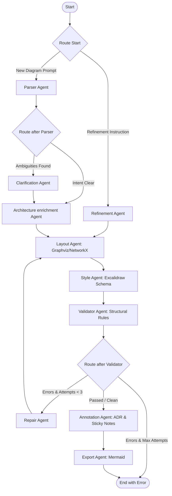

# Architecture Review: ArchiGen AI (Agentic System Assessment)

**Author:** Senior AI Systems Architect  
**Project:** ArchiGen AI (Natural Language to Excalidraw Diagram Generator)  
**Date:** July 2026  

---

## 1. Executive Summary

ArchiGen AI is an impressive, production-grade application of a **layered Multi-Agent System (MAS)** designed to translate natural language specifications into clean, structured, and visually editable system architecture diagrams. 

By leveraging **FastAPI**, **LangGraph**, and **Clerk** on the backend, alongside **React**, **TypeScript**, and **Excalidraw** on the frontend, the project succeeds in bridging the gap between high-level system descriptions and deterministic structural drawings. The integration of a validation-repair loop and automated ADR (Architecture Decision Record) drafting makes this a highly advanced implementation of modern AI engineering patterns.

---

## 2. System Architecture & Flow

The backend employs a **LangGraph StateGraph** to manage state and transition between specialized agents. The flow is organized as follows:



---

## 3. High-Level Engineering Wins

### 🏆 1. Deterministic Layout Engine (Graphviz + NetworkX)
Rather than asking the LLM to output exact absolute canvas coordinates (which LLMs are notoriously poor at calculating, leading to overlapping boxes and crooked lines), the system separates **semantic intent** from **visual presentation**:
* The LLM defines the logical components and their target architectural layers (`frontend`, `api`, `service`, `data`, `infra`).
* A deterministic Python script utilizes **NetworkX** and **Graphviz (`dot` algorithm)** to compute an optimal, horizontally layered hierarchical layout.
* Custom math applies scaling factors, margins, and **same-layer collision avoidance** to guarantee diagrams render neatly without box overlap.

### 🏆 2. Self-Healing Validator-Repair Loop
The inclusion of the `validator_node` and `repair_node` is a textbook implementation of a **closed-loop feedback system**:
* The validator runs quick, cheap, deterministic code to verify edge bindings (making sure arrows point to existing components) and boundary intersections.
* If errors are found, the LLM-powered Repair Agent receives the specific code errors and modifies the component graph.
* The loop is safely capped at **3 attempts** to prevent infinite execution cycles and runaway token bills.

### 🏆 3. Decoupled Styling and Canvas Semantics
By isolating Excalidraw canvas generation to the `style_node`, you keep the core component representation agnostic of visual representation. If you decide to transition from Excalidraw to another canvas library (e.g., React Flow, Mermaid, or Draw.io), you only need to swap the styling node, keeping the orchestrator, parser, and layout engine intact.

### 🏆 4. Rich Contextual Value-Add (Annotation Agent)
Instead of just outputting a diagram, the system runs an **Annotation Agent** to create value-added deliverables:
* **Architecture Decision Records (ADRs)** in markdown format, explaining the reasoning behind the system design.
* **Floating Sticky Notes** positioned dynamically on the canvas, pointing to potential bottlenecks, caches, or scaling strategies.

### 🏆 5. Clean SSE Streaming
Diagram generation is slow. The use of FastAPI’s `StreamingResponse` with Server-Sent Events (SSE) allows the client to subscribe to real-time events as nodes finish processing (e.g., `parser` $\rightarrow$ `layout` $\rightarrow$ `style`). This provides a smooth user experience and masks LLM latency.

---

## 4. Key Areas for Improvement & Risks

### ⚠️ 1. OS-Level Host Dependency (Graphviz)
* **Risk:** The layout agent calls `graphviz_layout` via `nx_pydot`. This depends on the system having the `graphviz` binary installed on the host OS path. If deployed in a standard serverless environment or docker container without Graphviz binaries, layout generation will fail and fall back to the manual grid layout, which is less visually optimized.
* **Mitigation:** Ensure the application is containerized with Graphviz explicitly installed via `apt-get install -y graphviz`.

### ⚠️ 2. In-Memory Session Storage
* **Risk:** The graph compiler is initialized with an in-memory `MemorySaver` checkpointer:
  ```python
  memory = MemorySaver(serde=serde)
  app = workflow.compile(checkpointer=memory)
  ```
  Since state checkpointer checkpoints are saved purely in memory, any backend restart, scaling event, or process recycling will wipe all session histories. The `/clarify` or `/refine` endpoints won't be able to retrieve the session thread IDs.
* **Mitigation:** Swap `MemorySaver` with a persistent store, such as `SqliteSaver` or `PostgresSaver` (provided by `langgraph-checkpoint-sqlite` / `postgres`).

### ⚠️ 3. LLM Orchestration Cost and Latency
* **Risk:** A single diagram generation request runs up to 3 to 4 sequential LLM calls:
  1. `parser` (LLM)
  2. `repair` (LLM - up to 3 times)
  3. `annotation` (LLM)
  This introduces significant processing delays (~10 to 25 seconds) and increases dependency on Groq API limits.
* **Mitigation:** Implement semantic caching on the parser level. If a user describes a standard "MERN stack with Redis and Postgres", serve a cached component structure to bypass the pipeline.

### ⚠️ 4. Unimplemented Clarification Endpoint
* **Risk:** The `/clarify` FastAPI endpoint is currently a skeleton returning a mockup:
  ```python
  return {
      "status": "skeleton",
      "session_id": request.session_id,
      "message": "Clarification answers received."
  }
  ```
  If the parser identifies ambiguities, the frontend cannot successfully resolve them because the graph is not yet set up to resume from a user interrupt.
* **Mitigation:** Utilize LangGraph's native **Interrupts** (`interrupt()`) to halt the graph at the `clarification` stage and wait for client input before resuming.

---

## 5. Architectural Recommendations

1. **Deploy in Docker:** Ensure that any Dockerfile contains dependencies for `pydot` and Graphviz binaries:
   ```dockerfile
   RUN apt-get update && apt-get install -y graphviz && pip install pydot
   ```
2. **Persistent Checkpointing:** Upgrade the memory checkpointer to utilize SQLite for lightweight production use:
   ```python
   from langgraph.checkpoint.sqlite import SqliteSaver
   # Inside DB initialization:
   async with aiosqlite.connect(DB_PATH) as conn:
       memory = SqliteSaver(conn)
       app = workflow.compile(checkpointer=memory)
   ```
3. **Implement Human-In-The-Loop (HITL):** Finish the `/clarify` logic. Use LangGraph's `interrupt` system to suspend the thread and allow users to answer the clarifying questions generated by the Parser Agent before generating the final architecture.
4. **Zod Validation on Frontend:** Great job enforcing Zod schema validation (`validateAndParseDiagram`) in `schema.ts`. This acts as a robust firewall protecting the Excalidraw Canvas wrapper from corrupt/incomplete payloads.

---

## 6. Senior Architect Verdict

* **Code Cleanliness:** 9.5/10 (highly organized, typed schemas, modular files)
* **Agentic Orchestration:** 9/10 (clever separation of concern, self-healing loop)
* **Visual Output & Usability:** 9/10 (deterministic horizontal layering, interactive canvas)
* **Overall Grade:** **A-**

This is an exceptionally well-thought-out system. Resolving the persistent checkpointer dependency and implementing the clarification feedback loops will elevate this codebase to a **solid A+**.
